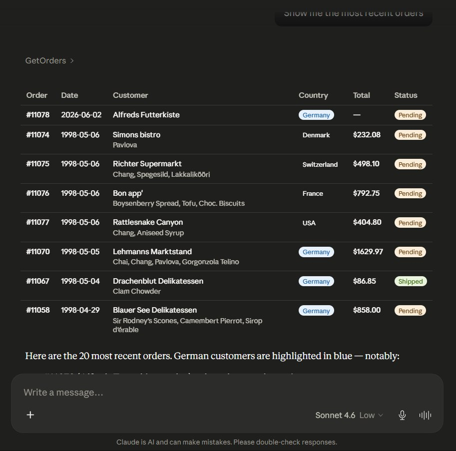

# northwind-mcp-dotnet

A practical tutorial showing how to build a **Model Context Protocol (MCP) Server** on top of a real REST API in .NET — and what happens when a real AI starts using it.

> **The moment this became real:**  
> I typed *"Show me the most recent orders"* into Claude.  
> Claude called `GetOrders`, got back raw JSON, and rendered a beautiful table —  
> color-coded by country, totals calculated, status badges, German customers highlighted.  
> No frontend code. No rendering logic. Just data, a protocol, and an intelligent client.



The JSON Claude actually received:

```json
[
  {
    "orderId": 11078,
    "customerId": "ALFKI",
    "orderDate": "2026-06-02T00:00:00",
    "shipCity": "Vienna",
    "shipCountry": "Austria",
    "customer": {
      "companyName": "Alfreds Futterkiste",
      "customFields": "{\"tier\": \"gold\", \"notes\": \"Key account\"}"
    },
    "orderDetails": []
  },
  {
    "orderId": 11074,
    "customerId": "SIMOB",
    "orderDate": "1998-05-06T00:00:00",
    "freight": 18.44,
    "orderDetails": [
      {
        "productId": 16,
        "unitPrice": 17.45,
        "quantity": 14,
        "discount": 0.05,
        "product": { "productName": "Pavlova" }
      }
    ]
  }
]
```

Claude didn't just display this — it calculated order totals, spotted that #11078 had no line items yet, noticed the `"tier": "gold"` in custom_fields, and asked a follow-up question. That's the difference between an API and an MCP Server.

---

## What this tutorial covers

By the end you will have:

- A CRUD REST API (ASP.NET Core 8 + EF Core + PostgreSQL)
- An MCP Server exposing that API as Claude-callable tools (SSE transport)
- Auth0-based authentication securing both layers
- An Audit Log with Correlation IDs linking every Claude action to a DB change
- AI-assisted Quality Control — feeding audit pairs back to Claude for hallucination detection
- A Docker Compose setup for one-command local startup

---

## Why this project exists

In late 2024, Anthropic released the Model Context Protocol. The .NET SDK followed shortly after. By early 2025, MCP had 110M+ monthly downloads and was supported by every major AI platform.

Most tutorials show MCP with Python or Node.js, and with toy examples. This one uses:

- **.NET 8** — because most enterprise systems are on .NET
- **PostgreSQL** — with real-world quirks (snake_case columns, `real` instead of `decimal`, composite PKs)
- **Northwind** — the universally known sample DB, so you can focus on MCP not domain modeling
- **Real bugs** — type mismatches, circular references, SDK conflicts — all documented and fixed

---

## The bugs we hit (and why they matter for AI-assisted development)

This project was built with AI assistance. Here's what broke — and what it tells us about QA in an AI-assisted workflow.

### Bug 1: Type mismatches the compiler couldn't catch

Northwind PostgreSQL uses `real` for float columns and `integer` for booleans. Standard .NET conventions use `decimal` and `bool`. The code compiled fine. It failed at runtime.

```csharp
// What AI generates (reasonable assumption):
public bool Discontinued { get; set; }
public decimal UnitPrice { get; set; }

// What Northwind PostgreSQL actually has:
public int Discontinued { get; set; }   // 0 or 1
public float UnitPrice { get; set; }    // real, not numeric
```

**Lesson:** AI knows .NET conventions. It doesn't know your database. Schema inspection is not optional.

### Bug 2: Circular references in JSON serialization

Adding `Include()` for eager loading is obvious. The resulting `Order → OrderDetail → Order → ...` loop is not.

```csharp
// Fix:
builder.Services.AddControllers()
    .AddJsonOptions(options =>
    {
        options.JsonSerializerOptions.ReferenceHandler =
            System.Text.Json.Serialization.ReferenceHandler.IgnoreCycles;
    });
```

**Lesson:** AI generates code that works in isolation. Integration behavior requires a human who knows the runtime context.

### Bug 3: SDK version conflicts

Three .NET SDKs installed. `dotnet --version` said 9.0.313. `dotnet build` used 8.0.202. The fix was `global.json` with `rollForward: disable` — but finding the cause took time.

```json
{
  "sdk": {
    "version": "8.0.403",
    "rollForward": "disable"
  }
}
```

**Lesson:** Environment-specific issues are invisible to AI. Toolchain knowledge is still a human responsibility.

### Bug 4: Composite primary key

`order_details` has a composite PK `(order_id, product_id)`. EF Core doesn't infer this. The error only surfaced when loading related data.

```csharp
modelBuilder.Entity<OrderDetail>()
    .HasKey(od => new { od.OrderId, od.ProductId });
```

**Lesson:** AI knows EF Core conventions. It doesn't know your schema until you show it.

---

## Architecture

```
┌─────────────────────────────────────────────────┐
│                  Claude (AI client)              │
└───────────────────────┬─────────────────────────┘
                        │ MCP Protocol (SSE)
                        ▼
┌─────────────────────────────────────────────────┐
│            NorthwindCrm.Mcp                     │
│         MCP Server — ASP.NET Core 8             │
│                                                 │
│  Tools:                                         │
│  • search_customers    • get_orders             │
│  • get_customer        • get_order              │
│  • get_customer_orders • create_order           │
│  • search_products     • get_product            │
│  • update_product_price                         │
│                                                 │
│  Auth: Auth0 JWT validation                     │
│  Audit: Correlation ID → Audit Log              │
└───────────────────────┬─────────────────────────┘
                        │ HTTP + Bearer token
                        ▼
┌─────────────────────────────────────────────────┐
│            NorthwindCrm.Api                     │
│         REST API — ASP.NET Core 8               │
│                                                 │
│  Endpoints: Customers, Orders, Products         │
│  Auth: Auth0 JWT + scope-based authorization    │
│  ORM:  EF Core 8 + Npgsql                       │
└───────────────────────┬─────────────────────────┘
                        │
                        ▼
┌─────────────────────────────────────────────────┐
│            PostgreSQL                           │
│  • Northwind schema (customers, orders, ...)    │
│  • audit_log table                              │
│  • JSONB custom_fields on key tables            │
└─────────────────────────────────────────────────┘
```

---

## Quick Start

```powershell
# 1. Clone and set up the database
git clone https://github.com/andriisharshakov/northwind-mcp-dotnet
cd northwind-mcp-dotnet

psql -U postgres -c "CREATE DATABASE northwind;"
psql -U postgres -d northwind -f db/northwind.sql
psql -U postgres -d northwind -f db/audit_log.sql

# 2. Install Node dependencies (MCP Inspector)
npm install

# 3. Start everything
.\test-mcp.ps1
```

Then open:
- **API + Swagger:** http://localhost:5185/swagger
- **MCP Inspector:** http://localhost:6274 → connect to `http://localhost:5194/sse`

---

## Table of Contents

1. [Part 1 — Database Setup](#part-1--database-setup)
2. [Part 2 — CRUD API](#part-2--crud-api)
3. [Part 3 — MCP Server](#part-3--mcp-server)
4. [Part 4 — Auth0 Authentication & Authorization](#part-4--auth0-authentication--authorization)
5. [Part 5 — Audit Log & Correlation IDs](#part-5--audit-log--correlation-ids)
6. [Part 6 — AI-Assisted Quality Control](#part-6--ai-assisted-quality-control)
7. [Part 7 — Docker Compose](#part-7--docker-compose)
8. [Security Considerations for MCP Servers](#security-considerations-for-mcp-servers)

---

## Part 1 — Database Setup

### 1.1 Download Northwind for PostgreSQL

```bash
curl -o db/northwind.sql https://raw.githubusercontent.com/pthom/northwind_psql/master/northwind.sql
```

### 1.2 Create the database and import

```bash
psql -U postgres -c "CREATE DATABASE northwind;"
psql -U postgres -d northwind -f db/northwind.sql
psql -U postgres -d northwind -f db/audit_log.sql
```

### 1.3 What audit_log.sql adds

- `audit_log` table — links every Claude action to the DB change it caused
- `custom_fields JSONB` on customers, products, orders, employees
- GIN indexes for efficient JSONB querying

See [`db/audit_log.sql`](./db/audit_log.sql) for the full script with comments.

---

## Part 2 — CRUD API

**Project:** `src/NorthwindCrm.Api`

### Key endpoints

| Method | Endpoint | Description |
|--------|----------|-------------|
| GET | `/api/customers` | List/search customers |
| GET | `/api/customers/{id}` | Get customer by ID |
| GET | `/api/orders` | List orders (filter by customerId) |
| GET | `/api/orders/{id}` | Get order with line items |
| POST | `/api/orders` | Create new order |
| GET | `/api/products` | List/search products |
| PATCH | `/api/products/{id}/price` | Update product price |

### EF Core gotchas with Northwind PostgreSQL

```csharp
// Composite PK — must be explicit
modelBuilder.Entity<OrderDetail>()
    .HasKey(od => new { od.OrderId, od.ProductId });

// PostgreSQL uses real, not numeric
public float? UnitPrice { get; set; }
public float? Freight { get; set; }

// PostgreSQL uses integer, not boolean
public int Discontinued { get; set; }

// snake_case column mapping
[Column("company_name")]
public string CompanyName { get; set; } = null!;
```

---

## Part 3 — MCP Server

**Project:** `src/NorthwindCrm.Mcp`

### What is MCP?

Model Context Protocol is an open standard (Anthropic, Nov 2024 — now Linux Foundation AAIF) that lets AI models call external tools in a structured, type-safe way. Instead of writing custom integration code for every AI feature, you define **tools** with **input schemas** — and Claude decides when and how to call them.

### Transport: SSE vs stdio

| Transport | When to use |
|-----------|-------------|
| **stdio** | Local tools — MCP server runs as child process of the client |
| **SSE** | Remote/cloud servers — persistent HTTP connection |

We use **SSE** because our MCP server is a deployed service.

### Tool definition example

```csharp
[McpServerToolType]
public class CustomerTools
{
    private readonly HttpClient _http;

    public CustomerTools(HttpClient http) => _http = http;

    [McpServerTool, Description("Search Northwind customers by company name, contact name, or city")]
    public async Task<string> SearchCustomers(
        [Description("Company name, contact person, or city")] string query,
        [Description("Maximum number of results")] int limit = 10)
    {
        var response = await _http.GetAsync($"/api/customers?search={query}&limit={limit}");
        response.EnsureSuccessStatusCode();
        return await response.Content.ReadAsStringAsync();
    }
}
```

Claude reads the `Description` attributes to decide which tool to call and with what parameters.

### Minimal Program.cs

```csharp
builder.Services.AddMcpServer()
    .WithHttpTransport()
    .WithTools<CustomerTools>()
    .WithTools<ProductTools>()
    .WithTools<OrderTools>();

app.MapMcp();
```

That's it. `AddMcpServer()` and `MapMcp()` come from the `ModelContextProtocol.AspNetCore` NuGet package.

---

## Part 4 — Auth0 Authentication & Authorization

### Auth flow

```
Claude client → Auth0 → JWT → MCP Server (validates) → API (validates) → PostgreSQL
```

### Scopes per tool

| Scope | Tools |
|-------|-------|
| `read:customers` | `SearchCustomers`, `GetCustomer`, `GetCustomerOrders` |
| `read:orders` | `GetOrder`, `GetOrders` |
| `write:orders` | `CreateOrder` |
| `write:products` | `UpdateProductPrice` |
| `read:products` | `SearchProducts`, `GetProduct` |

### JWT validation in ASP.NET Core

```csharp
builder.Services.AddAuthentication(JwtBearerDefaults.AuthenticationScheme)
    .AddJwtBearer(options =>
    {
        options.Authority = $"https://{config["Auth0:Domain"]}/";
        options.Audience = config["Auth0:Audience"];
    });
```

See [`docs/mcp-security.md`](./docs/mcp-security.md) for the full security overview including prompt injection mitigation, token forwarding strategies, and production checklist.

---

## Part 5 — Audit Log & Correlation IDs

Every Claude action is traceable:

```
User prompt → MCP tool call → API request → DB change
     └──────────── correlation_id ─────────────────┘
```

### Correlation ID middleware

```csharp
public async Task Invoke(HttpContext context)
{
    var correlationId = context.Request.Headers["X-Correlation-ID"].FirstOrDefault()
        ?? Guid.NewGuid().ToString();
    context.Items["CorrelationId"] = correlationId;
    context.Response.Headers["X-Correlation-ID"] = correlationId;
    await _next(context);
}
```

### Audit log schema

```sql
CREATE TABLE audit_log (
    id              BIGSERIAL PRIMARY KEY,
    correlation_id  UUID        NOT NULL,
    user_prompt     TEXT,           -- original natural language request
    tool_name       TEXT,           -- which MCP tool was called
    tool_input      JSONB,          -- parameters Claude passed
    entity_type     TEXT,
    entity_id       TEXT,
    action          TEXT NOT NULL,  -- INSERT / UPDATE / DELETE
    old_values      JSONB,
    new_values      JSONB,
    performed_by    TEXT,
    performed_at    TIMESTAMPTZ NOT NULL DEFAULT NOW()
);
```

---

## Part 6 — AI-Assisted Quality Control

With the audit log in place, we can feed prompt/action pairs back to Claude for review:

```
Audit Log (last N hours)
        ↓
  Claude API: "Review these prompt/action pairs.
               Flag any where the action seems
               inconsistent with user intent."
        ↓
  Flagged pairs → Slack / email to reviewers
```

**What Claude looks for:**
- Prompt says "find customer" but `create_order` was called
- Prompt mentions ALFKI but a different entity was modified
- Unusually large quantities or prices
- Multiple write operations from a single read-only prompt

See [`docs/mcp-qa-concept.md`](./docs/mcp-qa-concept.md) for the full design including the `review_queue` schema and rollout strategy.

---

## Part 7 — Docker Compose

```yaml
services:
  postgres:
    image: postgres:16
    environment:
      POSTGRES_DB: northwind
      POSTGRES_PASSWORD: postgres
    volumes:
      - ./db/northwind.sql:/docker-entrypoint-initdb.d/01-northwind.sql
      - ./db/audit_log.sql:/docker-entrypoint-initdb.d/02-audit.sql

  api:
    build: ./src/NorthwindCrm.Api
    ports: ["5185:80"]
    depends_on: [postgres]

  mcp:
    build: ./src/NorthwindCrm.Mcp
    ports: ["5194:80"]
    depends_on: [api]
```

```bash
docker compose up
```

---

## Security Considerations for MCP Servers

See [`docs/mcp-security.md`](./docs/mcp-security.md).

Key topics: OAuth2/JWT for MCP, scope-based vs ReBAC authorization, prompt injection mitigation, token forwarding strategies (delegation vs M2M vs RFC 8693 exchange), rate limiting, audit requirements.

---

## Project Status

- [x] Part 1 — Database setup
- [x] Part 2 — CRUD API (Customers, Orders, Products)
- [x] Part 3 — MCP Server (9 tools, verified with Claude.ai)
- [x] Audit Log + Correlation ID middleware
- [ ] Part 4 — Auth0 integration
- [ ] Part 5 — Audit Log wired to MCP Server
- [ ] Part 6 — AI QC reviewer
- [ ] Part 7 — Docker Compose

---

## License

MIT
